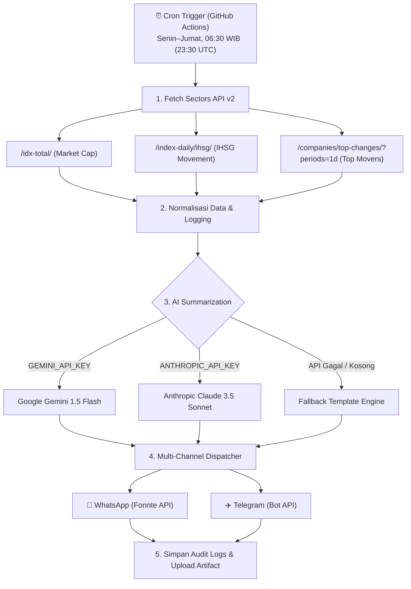

# sectors-daily-brief

Brief pasar saham IDX harian otomatis — mengambil data IHSG, top gainers/losers, dan performa sektor dari **Sectors Financial API (v2)**, merangkumnya menggunakan **Google Gemini / Anthropic Claude**, lalu mengirim ringkasan ke **WhatsApp (via Fonnte)** dan/atau **Telegram** setiap pagi hari bursa tanpa campur tangan manual.

Disiapkan untuk **Sectors Hackathon 2026, Track 02 — Automation & Workflows**.

---

## 📋 Alur Kerja (Workflow Architecture)



---

## 🚀 Fitur Unggulan (Track 02 Compliance)

- **100% Fully Autonomous**: Dijalankan secara otomatis melalui cron job di GitHub Actions setiap hari bursa (Senin–Jumat pukul 06:30 WIB) tanpa perlu intervensi manual.
- **Sectors API v2 Integration**: Mengambil data komprehensif pasar saham Indonesia (IHSG, top gainers/losers, total market cap) secara efisien (hanya 4 credit per run).
- **Multi-Channel Notification**: Mendukung pengiriman ke **WhatsApp** (Fonnte API) dan **Telegram Bot API** secara fleksibel (bisa salah satu atau keduanya sekaligus).
- **Dual AI Engine with Graceful Fallback**: 
  - Mendukung **Google Gemini** dan **Anthropic Claude**.
  - Jika API key tidak diset atau kuota habis, otomatis beralih ke **Fallback Template Engine** sehingga pesan brief tetap terkirim 100%.
- **Enterprise-grade Robustness**: 
  - Retry otomatis dengan *exponential backoff* (`tenacity`) untuk menangani gangguan jaringan atau rate limit.
  - Logging audit lengkap yang diunggah otomatis sebagai **GitHub Actions Artifact**.
  - Alert darurat otomatis ke admin jika terjadi kegagalan sistem.

---

## 🛠️ Tech Stack

| Komponen | Teknologi |
|---|---|
| Bahasa | Python 3.11+ |
| Data Provider | Sectors Financial API (v2) |
| Scheduler | GitHub Actions (`cron: '30 23 * * 0-4'`) |
| AI Engine | Google Gemini 1.5 Flash / Anthropic Claude 3.5 Sonnet |
| Notifikasi | Fonnte API (WhatsApp) & Telegram Bot API |
| Resilience | `tenacity` (retry with exponential backoff) |
| Testing | `pytest` |

---

## ⚙️ Cara Menjalankan Secara Lokal

1. Clone repositori ini:
   ```bash
   git clone https://github.com/WithinTheDream/briefin.git
   cd briefin
   ```
2. Buat file `.env` berdasarkan `.env.example` dan isi token Anda:
   ```env
   SECTORS_API_KEY=your_sectors_api_key
   FONNTE_TOKEN=your_fonnte_token
   WHATSAPP_TARGET=0812xxxxxxxx
   TELEGRAM_BOT_TOKEN=...
   TELEGRAM_CHAT_ID=...
   GEMINI_API_KEY=...
   ```
3. Install dependensi:
   ```bash
   pip install -r requirements.txt
   ```
4. Jalankan script utama:
   ```bash
   python src/main.py
   ```

---

## 🔄 Konfigurasi GitHub Actions

Untuk deploy otomatisasi ke GitHub Actions:
1. Masukkan API keys sebagai **Repository Secrets** di GitHub (`Settings` > `Secrets and variables` > `Actions`):
   - `SECTORS_API_KEY` (Wajib)
   - `FONNTE_TOKEN` (Untuk WhatsApp)
   - `WHATSAPP_TARGET` (Nomor/Grup WA tujuan)
   - `TELEGRAM_BOT_TOKEN` (Untuk Telegram)
   - `TELEGRAM_CHAT_ID` (ID Telegram)
   - `GEMINI_API_KEY` / `ANTHROPIC_API_KEY` (Opsional untuk AI Summary)
2. Workflow otomatis berjalan setiap pukul **23:30 UTC (06:30 WIB) Senin–Jumat**.
3. Trigger manual juga tersedia via tab **Actions** > **Daily Market Brief** > **Run workflow**.

---

## 🧪 Testing

Jalankan seluruh rangkaian unit test:
```bash
pytest tests/
```
