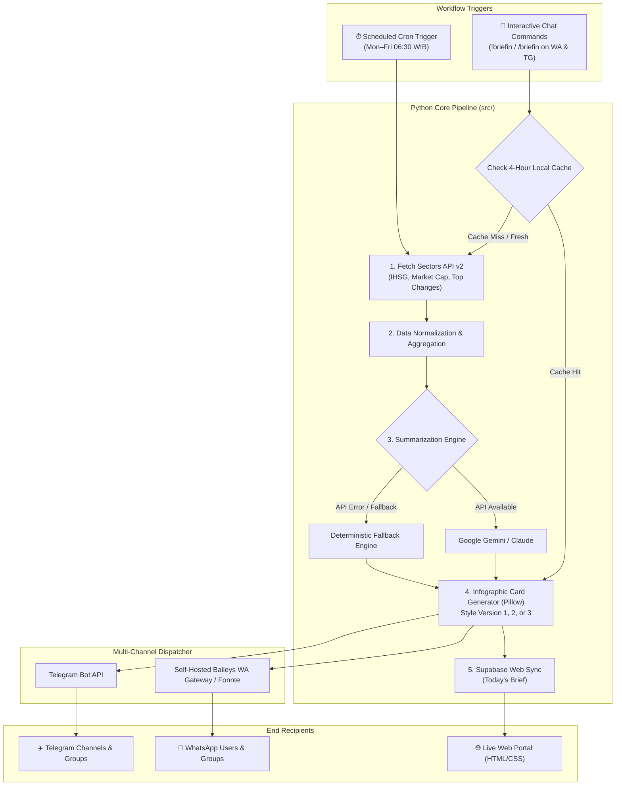

# 📈 Briefin — Autonomous Daily IDX Market Brief & AI Assistant

[](https://www.python.org/)
[](https://nodejs.org/)
[](https://github.com/WhiskeySockets/Baileys)
[](https://core.telegram.org/bots/api)
[](https://sectors.app)
[](https://deepmind.google/technologies/gemini/)
[](https://supabase.com)
[](LICENSE)

> **Briefin** is an autonomous AI-powered Indonesian Stock Exchange (IDX) market assistant. It fetches official stock market data directly from the **Sectors Financial API (v2)**, synthesizes high-impact market narratives using **Google Gemini / Anthropic Claude**, renders high-resolution infographic cards, and broadcasts daily briefs automatically and on-demand via **WhatsApp** and **Telegram**.

Engineered and optimized for **Sectors Hackathon 2026 — Track 02 (Automation & Workflows)**.

---

## 🌟 What is Briefin?

Before the opening bell rings on the Indonesian Stock Exchange (IDX) at 09:00 WIB, investors and traders typically waste valuable morning hours sifting through fragmented news outlets to check IHSG movement, top movers, sector performance, net foreign capital flow, and global commodity trends.

**Briefin automates this entire daily workflow end-to-end:**
1. **Fetches Up-to-the-Minute IDX Market Data**: Queries IHSG performance, aggregate market capitalization, and top gainers/losers via the Sectors API v2 with ultra-efficient credit usage (~4 credits per run).
2. **AI-Powered Market Summaries**: Converts raw tabular financial data into actionable, concise, and structured market narratives.
3. **Automated Infographic Card Generation**: Renders clean, high-resolution market infographic cards ready to share across trading groups.
4. **Intelligent Multi-Channel Dispatch**: Distributes briefs to WhatsApp and Telegram on a scheduled cron basis (weekdays at 06:30 WIB) or dynamically via interactive two-way bot commands.

---

## 🚀 Key Features

### 1. 🤖 Interactive Two-Way Chat Bot (WhatsApp & Telegram)
More than just a passive broadcast service, Briefin functions as an interactive conversational bot:
- **`!daftar` / `/daftar`**: Self-service registration to automatically receive daily morning briefs at 06:30 WIB.
- **`!topik` / `/topik`**: Personalize content across **9 financial market topics** (IHSG, Gainers, Losers, Sector Performance, Net Foreign Flow, Macro/Commodities, IPO & Corporate Actions, Technical Watchlist, Money Management/Strategy).
- **`!kartu` / `/kartu`**: Choose between **3 infographic card visual styles**:
  - *Version 1 (Standard Movers)*: Clean IHSG Composite pulse + Top 5 Gainers & Losers.
  - *Version 2 (Sector & Macro Radar)*: IDX Sector Heatmap + Global Macro (Oil, Gold, CPO) & Technical Watchlist.
  - *Version 3 (Executive All-in-One)*: Comprehensive 3-column executive dashboard.
- **`!briefin` / `/briefin`**: **Instant on-demand trigger**. Want to check market conditions right now without waiting for tomorrow morning? Send this command to receive the latest brief within 1–2 seconds!
- **`!web` / `/web`**: Get direct links to the live Today's Market Brief web portal.
- **`!info` & `!batal`**: Transparent subscription status check and effortless instant unsubscription.

### 2. ⚡ Smart 4-Hour Local Caching
The on-demand trigger (`!briefin`) is backed by a 4-hour local caching system:
- Normalized market datasets and AI summaries are temporarily cached in `logs/`.
- Subsequent requests throughout the day are served in 1–2 seconds without wasting Sectors API credits or AI token quotas.

### 3. 🛡️ Dual AI Engine with Graceful Fail-Safe Fallback
- Supports both **Google Gemini 1.5 Flash** and **Anthropic Claude 3.5 Sonnet**.
- Features an intelligent **Deterministic Fallback Template Engine**: If an AI API key is missing, rate-limited, or offline, Briefin instantly switches to structured template generation, guaranteeing 100% broadcast delivery.

### 4. 🗄️ Dual Persistence Strategy (Supabase Cloud + Local Backup)
- Subscriber state, topic preferences, and visual card styles are persistently synchronized with **Supabase**.
- Automatically falls back to an offline-safe local JSON storage (`subscribers.json`) if cloud connectivity is unavailable.

### 5. 🌐 Self-Hosted WhatsApp Gateway (Baileys) & Fonnte Fallback
- Lightweight self-hosted Node.js gateway powered by `@whiskeysockets/baileys` (no costly third-party API subscription required).
- Strict phone number and JID normalization supporting standard numbers (`08...`, `628...`), WhatsApp IDs (`@s.whatsapp.net`), group chats (`@g.us`), and linked identities (`@lid`).
- Deduplication algorithms ensure recipients never receive duplicate broadcasts.
- Optional fallback integration with **Fonnte API** for headless cloud deployments.

---

## 🏛️ System Architecture & Workflow


```mermaid
flowchart TD
    subgraph Trigger["Workflow Triggers"]
        T1["⏰ Scheduled Cron Trigger<br>(Mon–Fri 06:30 WIB)"]
        T2["💬 Interactive Chat Commands<br>(!briefin / /briefin on WA & TG)"]
    end

    subgraph Core["Python Core Pipeline (src/)"]
        F1["1. Fetch Sectors API v2<br>(IHSG, Market Cap, Top Changes)"]
        F2{"Check 4-Hour Local Cache"}
        F3["2. Data Normalization & Aggregation"]
        F4{"3. Summarization Engine"}
        F5["Google Gemini / Claude"]
        F6["Deterministic Fallback Engine"]
        F7["4. Infographic Card Generator (Pillow)<br>Style Version 1, 2, or 3"]
        F8["5. Supabase Web Sync<br>(Today's Brief)"]
    end

    subgraph Dispatcher["Multi-Channel Dispatcher"]
        D1["Self-Hosted Baileys WA Gateway / Fonnte"]
        D2["Telegram Bot API"]
    end

    subgraph Output["End Recipients"]
        O1["📱 WhatsApp Users & Groups"]
        O2["✈️ Telegram Channels & Groups"]
        O3["🌐 Live Web Portal (HTML/CSS)"]
    end

    T1 --> F1
    T2 --> F2
    F2 -->|Cache Hit| F7
    F2 -->|Cache Miss / Fresh| F1
    F1 --> F3
    F3 --> F4
    F4 -->|API Available| F5
    F4 -->|API Error / Fallback| F6
    F5 & F6 --> F7
    F7 --> F8
    F7 --> D1 & D2
    D1 --> O1
    D2 --> O2
    F8 --> O3
```

---

## 📁 Project Directory Structure

```text
briefin/
├── .github/
│   └── workflows/
│       └── daily-brief.yml        # GitHub Actions cron & dispatch workflow
├── logs/                          # Local execution audit logs and caches
├── src/
│   ├── fetch_sectors.py           # Sectors Financial API (v2) client
│   ├── format_brief.py            # Data normalization & Fallback Template Engine
│   ├── generate_card.py           # Infographic card generator (3 styles via Pillow)
│   ├── main.py                    # Core pipeline orchestrator & CLI entrypoint
│   ├── send_telegram.py           # Telegram notification & media dispatcher
│   ├── send_whatsapp.py           # WhatsApp dispatcher (Baileys HTTP & Fonnte)
│   ├── summarize_ai.py            # AI summarization (Google Gemini & Claude)
│   └── telegram_bot.py            # Interactive Telegram polling bot service
├── tests/
│   ├── test_fetch_sectors.py      # Unit tests for Sectors API fetching
│   └── test_send_whatsapp.py      # Unit tests for WhatsApp message formatting
├── wa-gateway/                    # Self-hosted WhatsApp Baileys Gateway (Node.js)
│   ├── auth_session/              # WhatsApp credentials and session storage
│   ├── db.js                      # Database adapter (Supabase + local JSON)
│   ├── package.json               # Node.js dependencies
│   ├── server.js                  # Express server & Baileys socket handlers
│   └── subscribers.json           # Offline subscriber fallback storage
├── .env.example                   # Example environment variables
├── requirements.txt               # Python package dependencies
└── README.md                      # Project documentation
```

---

## ⚙️ Quick Start (Local Setup)

### 1. Prerequisites
- **Python 3.11+** installed ([Download Python](https://www.python.org/downloads/)).
- **Node.js 18+ & npm** installed ([Download Node.js](https://nodejs.org/)).
- An active API key from [Sectors Financial API](https://sectors.app).
- A [Google AI Studio (Gemini)](https://aistudio.google.com/) API key *(recommended)* or Anthropic Claude API key.

---

### 2. Repository Clone & Environment Setup
Clone the repository and copy the example environment file:
```bash
git clone https://github.com/WithinTheDream/briefin.git
cd briefin
cp .env.example .env
```

Open `.env` in your preferred editor and configure your credentials:
```env
# Sectors Financial API Key (Required)
SECTORS_API_KEY=your_sectors_api_key_here

# AI Summarization (Gemini or Claude)
GEMINI_API_KEY=your_gemini_api_key_here
# ANTHROPIC_API_KEY=your_claude_api_key_here

# WhatsApp Configuration (Self-Hosted Baileys Gateway)
WA_GATEWAY_URL=http://localhost:3000
WHATSAPP_TARGET=081234567890

# Supabase Cloud Database (Optional - defaults to local subscribers.json)
SUPABASE_URL=https://your-project.supabase.co
SUPABASE_KEY=your_supabase_key

# Telegram Bot (Optional)
# TELEGRAM_BOT_TOKEN=your_bot_token
# TELEGRAM_CHAT_ID=your_chat_id
```

---

### 3. Launch WhatsApp Gateway (Baileys)
Open your first terminal and start the self-hosted WhatsApp Gateway:
```bash
cd wa-gateway
npm install
npm start
```
* **QR Code Pairing**: On first run, a QR code will render in the terminal.
* Open WhatsApp on your mobile phone > **Settings** > **Linked Devices** > **Link a Device** > Scan the terminal QR code.
* Once linked, the server will log `CONNECTED` on port `3000`. Credentials are saved securely in `wa-gateway/auth_session/`.

---

### 4. Run the Python Pipeline
Open a second terminal in the project root:
```bash
# Set up a virtual environment (recommended)
python -m venv venv
# Windows:
venv\Scripts\activate
# Linux/macOS:
source venv/bin/activate

# Install Python dependencies
pip install -r requirements.txt

# Run the brief generation & dispatch workflow
python src/main.py
```

#### CLI Execution Arguments:
```bash
# Send directly to a specific target phone number or group JID:
python src/main.py --target "081234567890"

# Select an infographic card visual style (1, 2, or 3):
python src/main.py --card 3

# Specify custom infographic card output path:
python src/main.py --output "market_card.png"
```

---

### 5. Launch the Interactive Telegram Bot (Optional)
If you wish to enable the Telegram bot companion service, run the polling script in a separate terminal:
```bash
python src/telegram_bot.py
```
Telegram users can now send `/start`, `/topik`, `/kartu`, and `/briefin` interactively.

---

## 💬 Interactive Chat Command Reference

Subscribers can use the following commands on WhatsApp and Telegram at any time:

| WhatsApp Command | Telegram Command | Description |
|---|---|---|
| `!daftar` | `/daftar` or `/start` | Subscribe to receive automated daily briefs every trading day at 06:30 WIB. |
| `!briefin` | `/briefin` | **Instant Trigger**: Generate and receive today's market brief and card immediately. |
| `!topik` | `/topik` | View and configure preferences across 9 market topics. |
| `!topik 1,4,8` | `/topik 1,4,8` | Select specific topics (e.g., IHSG, Sector Performance, Watchlist). |
| `!topik all` | `/topik all` | Select all 9 comprehensive market topics. |
| `!kartu` | `/kartu` | View available infographic visual card styles. |
| `!kartu 1/2/3`| `/kartu 1/2/3`| Change preferred infographic card style to Version 1, 2, or 3. |
| `!web` | `/web` | Get links to the live Today's Market Brief web portal. |
| `!info` | `/info` | Check current subscription status, active topics, and card style. |
| `!batal` | `/batal` or `/stop` | Unsubscribe from the daily service instantly. |

---

## ☁️ Autonomous Deployment (GitHub Actions)

Briefin can operate completely serverless via **GitHub Actions**:
1. Navigate to your GitHub repository > **Settings** > **Secrets and variables** > **Actions**.
2. Add your **Repository Secrets**:
   - `SECTORS_API_KEY`: Sectors Financial API token.
   - `GEMINI_API_KEY`: Google AI Studio token.
   - `FONNTE_TOKEN` & `WHATSAPP_TARGET`: Fonnte credentials for WhatsApp cloud dispatch.
   - `TELEGRAM_BOT_TOKEN` & `TELEGRAM_CHAT_ID`: Telegram credentials.
3. The workflow runs autonomously every Monday through Friday at **23:30 UTC (06:30 WIB)** via [`.github/workflows/daily-brief.yml`](.github/workflows/daily-brief.yml).
4. Manual dispatch is also available under the **Actions** tab > **Daily Market Brief** > **Run workflow**.

---

## 🧪 Testing

Briefin includes an automated test suite verifying Sectors API integration and WhatsApp message formatting:
```bash
python -m pytest tests/
```

To run tests with detailed output:
```bash
python -m pytest -v -s tests/
```

---

## 🤝 Contributing & License

Contributions, feedback, and pull requests are warmly welcome! Please open an issue to discuss proposed enhancements.

This project is open-source under the **[MIT License](LICENSE)**.

---
*Built with ❤️ for Indonesian capital market investors and traders.*
